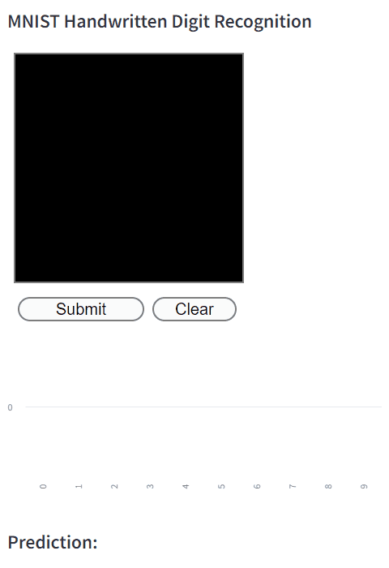

# MNIST-FastAPI-Streamlit

MNIST-FastAPI-Streamlitは、手書き数字認識を行うためのウェブアプリケーションです。  
MNISTデータセットでトレーニングされたモデルを使用し、StreamlitとFastAPIを使用して実際の手書き数字の識別を行うことが、このプロジェクトの主な目的です。

## 特徴
- **MNISTデータセット**を使用した手書き数字の認識
- **FastAPI**によるバックエンドAPIの構築
- **Streamlit**を使用したフロントエンドの開発

## 前提条件
このプロジェクトを実行するには以下が必要です：
- Python 3.9以上
- pipenv (Pythonのパッケージ管理ツール)

## インストール方法
このプロジェクトを始める前に、以下の手順に従って必要な依存関係をインストールしてください。

### 1. pipenvのインストール:  
pipenvはPythonの依存関係を管理するツールです。まだインストールしていない場合は、以下のコマンドでインストールできます。

```bash
pip install pipenv
```
### 2. プロジェクトの依存関係のインストール:  
このプロジェクトのフォルダに移動し、以下のコマンドを実行して必要なライブラリをインストールします。

```bash
pipenv install
```

## 使用方法
プロジェクトを実行するための主要なステップは以下の通りです：

### 1. モデルのトレーニング
MNISTデータセットを使用してモデルをトレーニングします。
```bash
pipenv run python train_model.py
```

### 2. モデルのテスト
トレーニングされたモデルをテストします。
```bash
pipenv run python test_model.py
```

### 3. FastAPIサーバーの起動
バックエンドAPIサーバーを起動します。
```bash
pipenv run python main.py
```

### 4. Streamlitフロントエンドの起動
Streamlitを使用したフロントエンドを起動します。
```bash
pipenv run streamlit run app.py
```


## License
This project is licensed under the MIT License - see the LICENSE file for details.